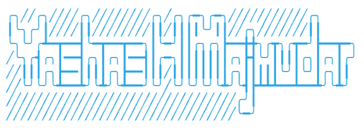

## Hi, I'm

### Welcome to my GitHub Profile! 🚀

💻 Full Stack Developer | 📱 Mobile App Wizard | 🌐 Cloud Enthusiast 

🔥 Passionate about creating elegant and efficient solutions to real-world problems. Constantly striving to improve my coding skills and staying up-to-date with the latest technologies.

👀 Things I know
### Front-End
&nbsp;
&nbsp;
&nbsp;
&nbsp;
&nbsp;

### Back-End
&nbsp;
&nbsp;
&nbsp;
&nbsp;
&nbsp;

### Database
&nbsp;
&nbsp;
&nbsp;

### DevOps
&nbsp;
&nbsp;
&nbsp;
&nbsp;

### Version Control
&nbsp;
&nbsp;

### Languages
&nbsp;
&nbsp;
&nbsp;
&nbsp;
&nbsp;
&nbsp;

### Cloud
&nbsp;

### ML
&nbsp;
&nbsp;
&nbsp;
&nbsp;
&nbsp;

### IoT
&nbsp;

### Other
&nbsp;
&nbsp;
&nbsp;
&nbsp;
&nbsp;
&nbsp;

🌱 Currently exploring the fascinating world of Artificial Intelligence and Machine Learning.

&nbsp;

🚀 Proud contributor to open-source projects and always looking for new opportunities to collaborate with fellow developers.

⭐️ Let's connect and build something amazing together! Feel free to reach out to me for any exciting projects or ideas.

📫 How to reach me:

&nbsp;
&nbsp;
&nbsp;
&nbsp;

🎤😶‍🌫 I sing too:

<!---
yashas-hm/yashas-hm is a ✨ special ✨ repository because its `README.md` (this file) appears on your GitHub profile.
You can click the Preview link to take a look at your changes.
--->
