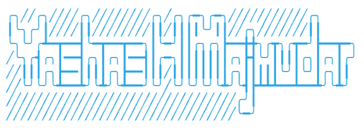

<!---
yashas-hm/yashas-hm is a ✨ special ✨ repository because its `README.md` (this file) appears on your GitHub profile.
You can click the Preview link to take a look at your changes.
--->

### Hi, I'm

#### Welcome to my GitHub Profile! 🚀

💻 Full Stack Developer | 📱 Mobile App Wizard | 🌐 Cloud Enthusiast 

🔥 I'm passionate about creating elegant and efficient solutions to real-world problems. Constantly striving to improve my coding skills and staying up-to-date with the latest technologies.

### 👀 Things I know

---

**Front-End**: `Flutter` `React.js` `HTML` `CSS`

**Back-End**: `Node.js` `Express.js` `GraphQL` `NGINX`

**Database**: `Firebase` `MongoDB` `MySQL` `PostgreSQL` `Supabase`

**DevOps**: `Docker` `GitHub Actions` `Jenkins` `Ansible` `Kubernetes`

**Version Control**: `Git` `Gitlab` 

**Cloud**: `AWS` `Google Cloud`

**Languages**: `Dart` `Python` `TypeScript` `JavaScript` `Java` `Bash` `C++` `Rust`

**Other**: `Swagger` `Postman` `Prometheus` `PowerBI` `Jira` `Slack` `Trello`

**Machine Learning**: `OpenCV` `TensorFlow` `Pandas` `NumPy` `SciKit-Learn`

**Internet Of Things** `RaspberryPi` `Arduino` `ESP32`

---

🌱 Currently exploring the fascinating world of Artificial Intelligence and Machine Learning.

🚀 Proud contributor to open-source projects and always looking for new opportunities to collaborate with fellow developers [View Here 🎉](./open-source.md).

⭐️ Let's connect and build something amazing together! Feel free to reach out to me for any exciting projects or ideas.

---

📫 How to reach me:

&nbsp;
&nbsp;
&nbsp;
&nbsp;

🎤😶‍🌫 I sing too:

### GitHub Stats

