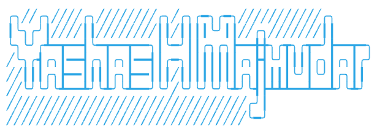

<!---
yashas-hm/yashas-hm is a ✨ special ✨ repository because its README.md appears on your GitHub profile.
--->

 
**Software Engineer · Full Stack · Flutter · AI Systems**

Building **production-grade software systems end-to-end**, from polished 
Flutter frontends to scalable backends and AI-powered pipelines.

**10K+ users · 99.8% uptime · 40% latency reduction · 40% crash reduction**

---

### 🌟 Highlights

- ✍️ I write about engineering & Flutter: [Blog](https://yashashm.medium.com/)
- 🎤 I give talks & workshops: [Talks](https://github.com/yashas-hm/talks)
- 🧩 I contribute to open source: [Contributions](./contributions.md)
- 🚀 I’ve shipped systems used by **10K+ users** with **99.8% uptime**
  
---

My work focuses on **shipping real products**, not demos:
- AI systems that care about **latency, reliability, and inference**
- Backend services that scale cleanly
- Mobile apps that feel fast, intentional, and human

I believe great engineering is where **architecture, performance, and product sense** meet.

---

### 🔍 What I work on

- **AI Systems**: RAG pipelines, LangChain, LLM integration, vector search
- **Backend Engineering**: FastAPI, Node.js, REST APIs, scalable data models
- **Mobile & Frontend**: Flutter apps with clean architecture and smooth UX
- **Infrastructure**: Dockerized deployments, CI/CD, cloud-native systems
- **Applied ML**: Computer vision, on-device ML, inference optimization

---

### 👀 Things I know

---

**Front-End**: `Flutter` `React.js` `HTML` `CSS`

**Back-End**: `FastAPI` `Node.js` `Express.js` `GraphQL`

**Database**: `Firebase` `MongoDB` `MySQL` `PostgreSQL` `Supabase`

**DevOps**: `Docker` `GitHub Actions` `Jenkins` `Ansible` `Kubernetes`

**Version Control**: `Git` `Gitlab` 

**Cloud**: `AWS` `Google Cloud`

**Languages**: `Dart` `Python` `TypeScript` `JavaScript` `Java` `Bash` `C++` `Rust` `Go`

**Other**: `Swagger` `Postman` `Prometheus` `Jira` `Slack` `Trello`

**ML/AI**: `OpenCV` `TensorFlow` `LLM` `HuggingFace` `LangChain`

**Internet Of Things** `RaspberryPi` `Arduino` `ESP32`

---

### 🌱 Current Focus

- Designing **AI-native application architectures**
- Improving **LLM inference performance & retrieval pipelines**
- Building systems that are **boring to deploy and exciting to use**
- Research on **VR Haptics**

---

### 📫 Connect with me

&nbsp;
&nbsp;
&nbsp;

---

### 🎤 Outside of code

I sing too because engineering needs rhythm 🎶  

